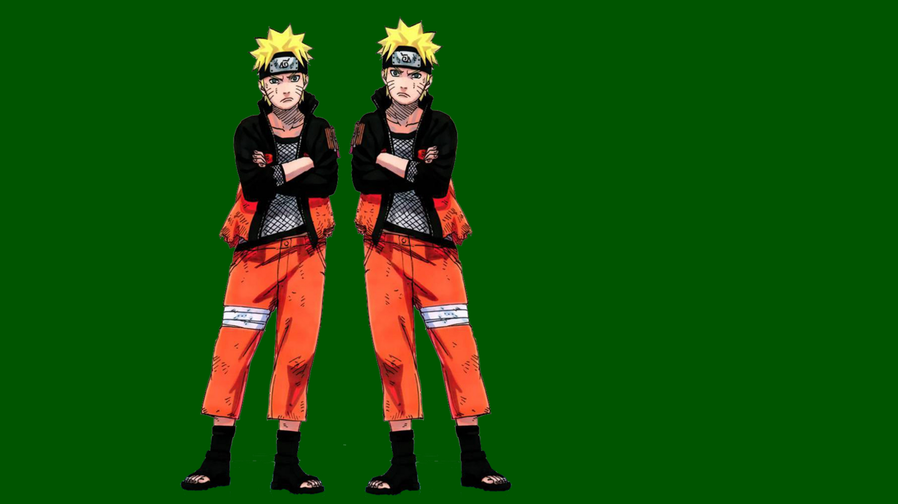
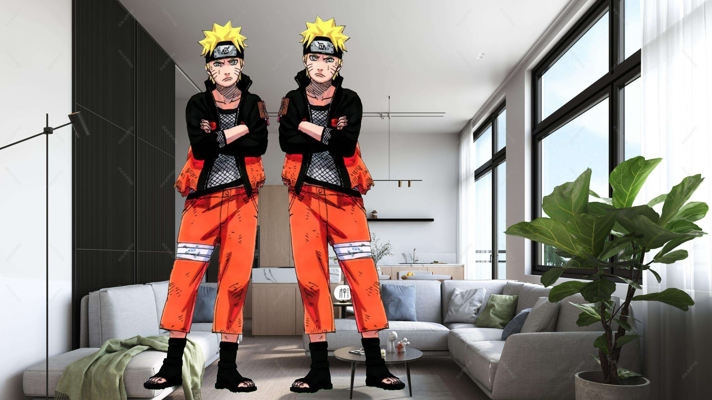
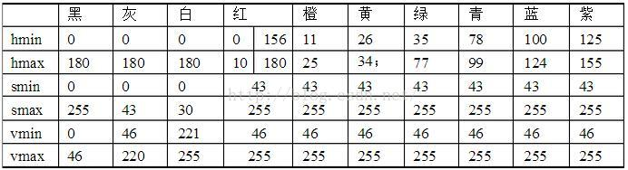

# ht_background_augmentation
基于纯色背景板的数据增强 通过采用纯色板子作为检测物体的背景 ，通过后期将背景替换成各种各样的场景，来达到对数据集的扩充，这种方法可以提升检测算法的鲁棒性。

**原图：**

**加上背景：**

# 纯色板子制作

纯色板子（通常采用绿色板）可以购买Kt板，在kt板上打印上纯色图像来制作。

纯色图片可通过xxx脚本生成，并可自己指定尺寸大小和颜色

# 代码

- create_board_image.py :生成纯色图片
- get_hsv.py ：获取图片中的hsv值
- background_augmentation.py ：替换背景
- 其他

# 各颜色HSV阈值

如果是RGBD图像，通过一些图像处理，可以直接进行背景的数据增强而不需要背景板，并且可以进行更复杂的数据集扩充，参考xxxx

也可以将检测物体和标注文件都迁移到绿色板子处，参考